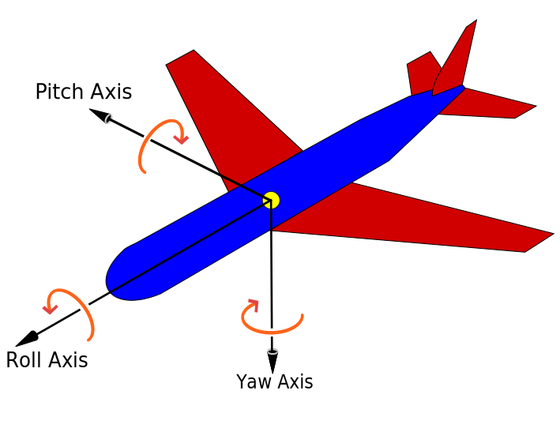

# Orientation

## 原理

参考百科[【航空器三主轴】](https://zh.wikipedia.org/wiki/%E8%88%AA%E7%A9%BA%E5%99%A8%E4%B8%89%E4%B8%BB%E8%BD%B4)



- heading(yaw) 横向旋转弧度
- pitch 前后倾斜弧度
- roll 左右旋转弧度

例如向视角调整为正俯视，即前后（pitch）逆时针旋转 90 度：

```js
viewer.camera.setView({
  orientation: {
    headding: 0,
    pitch: Cesium.Math.toRadians(-90),
    roll: 0
  }
});
```